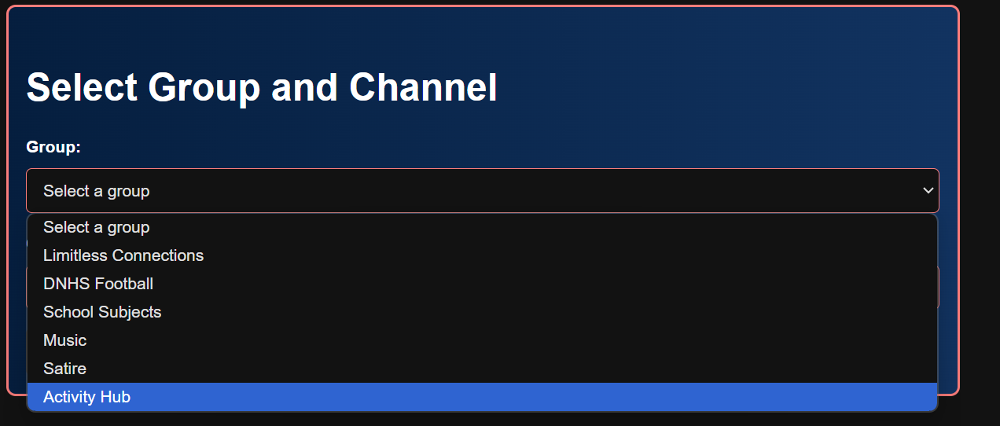
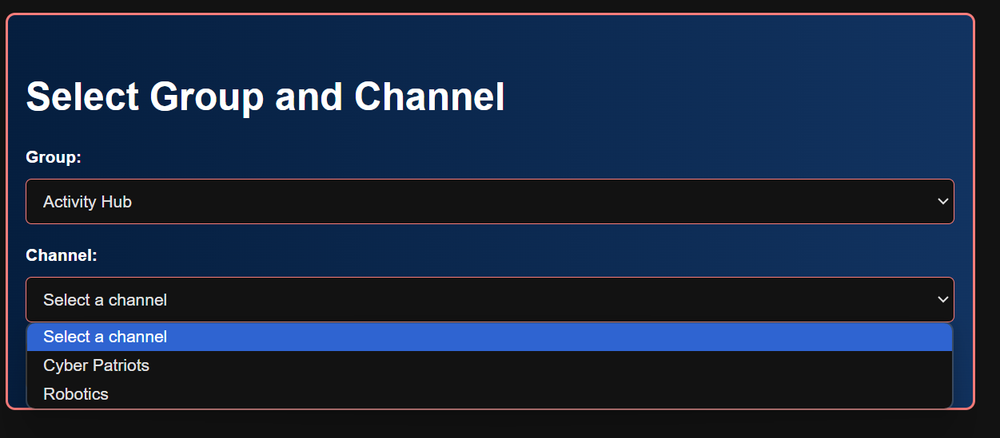

# MCQ Blog

I got 66/66 on this assignment so this blog will primarily be focused on questions I spent the longest time on and had the most difficulty with.

I will go over each Big Idea from 1-5 and go through the question I found most difficult for each of those Big Ideas.

Proof of Score: <br>


## Big Idea 1


I found this question to be the most challenging for this portion of the practice exam because of the actual applied logic required to answer this question. I had to manually go through each of the steps in both of the proposed code solutions and figure out which one worked in accordance to the answers, which caused an influx in time to solve this problem.

Answer choice C is correct for this question because it doesnt calculate the averga after every iteration, but rather does it at the end. <br>

## Big Idea 2


This question was the most time consuming because it is about logic gates. While I have some past experience with how logic gates work, I needed a little refresher to get the juices flowing again. I manually tried every option choice to check its output, and thus landed at option choice A.

This answer is correct because if we consider the following table,

| Variable | Value  |
|----------|--------|
| A        | True   |
| B        | False  |
| C        | False  |
| D        | False  |

A AND B gives False, C OR D gives False, and False OR False outputs False, which is what we were aiming for.

## Big Idea 3


I found this question to be the hardest because it was a culmination of math and computer science. I had to think about how I myself would try to draw it, and then try to replicate it in code for the computer, which I think is a very important skill to have while coding.

My answer is right because it starts at (3,6), and it draws a circle with raiud 2, and moves the circle right 2 and down 2, and repeats this thrice. Repeating this procedure by hand would result in the same graph being drawn.

## Big Idea 4


This was for me, the hardest question in Big Idea 4 because of its requirement to find the impurity with the given code. These types of problems are always hard for me, and thus took the most time for me on this section. The error I eventually I found was that, if the first number of the list is less than the second number, it automatically returns the first number, without checking the rest of the list to find any other possible minimums.

However, if the first number is not less than the second number, it will return the second number.

My answer is correct for this question because both testcases fail in this code. In Option C, 30 is less than 40, and so 30 gets outputed (instead of 10). Similarly, in Option D, 40 is not less than 30, so it will automatically output 30 (again instead of 10).

## Big Idea 5


In Big Idea 5, this was the most challenging question due its more math oriented nature, not computer science. Reading through the data table and identifying the nuances with how the final grades are calculated took some time for me, and was not as easy as some of the other questions. In the end, all 3 options are right because it is possible to calculate the average (add up all the total scores and divide by number of entries), the average increase (total points - (midterm + final)), and the proportion of students who improved their total points, again by doing the aforementioned calculation.

---

# Sprint 3 Blog

The accomplishment I am most proud about in Sprint 3 is getting the **backend to work**, meaning our frontend was able to "talk" to the backend.

We designed our backend according to this DrawIO Diagram. As the scrum master of my group, I urged my group members to neatly plan everything out before coding, which I find an essential skill, not just in coding.


As the backend developer of my team, I was in charge of connecting the frontend to the backend and creating the channels and groups for my team, as well **filtering** the channels to be specific to our own project.

I considered this to be one of the major accomplishments that I had. I fetched the posts, sorted by the groups and individual channels for each group, and then display them using frontend styling learned in previous Sprints.

The code connecting the frontend to the backend can be broken down into 3 main subgroups. They are: Fetching and Filtering Groups, Fetching and Filtering Channels, and a Form Submission to Fetch, Display, and add Posts.

## 1. Fetching and Filtering Groups

The ```fetchGroups()``` function sends a ```POST``` request to the specifically to the filtered backend at ```(/api/groups/filter)`` to retrieve groups filtered by section_name, which in our case was Shared_Interests. The response was then used to populate a dropdown menu for group selection, allowing users to choose from the available options.

```js
async function fetchGroups() {
    try {
        const response = await fetch(`${pythonURI}/api/groups/filter`, {
            ...fetchOptions,
            method: 'POST',
            headers: {
                'Content-Type': 'application/json'
            },
            body: JSON.stringify({ section_name: "Shared Interest" })
        });
        if (!response.ok) {
            throw new Error('Failed to fetch groups: ' + response.statusText);
        }
        const groups = await response.json();
        const groupSelect = document.getElementById('group_id');
        groups.forEach(group => {
            const option = document.createElement('option');
            option.value = group.name;
            option.textContent = group.name;
            groupSelect.appendChild(option);
        });
    } catch (error) {
        console.error('Error fetching groups:', error);
    }
}
```

## 2. Fetching Channels Based on Group selection

When a user selects a group from the ```group_id``` dropdown, the ```fetchChannels()``` function is called. This function sends a ```POST request``` to the backend filtered API endpoint ```(/api/channels/filter)``` and includes the selected group's name in the request body. The backend returns a filtered list of channels associated with that group. The function processes the response and repopulates the ```channel_id``` dropdown with new ```<option>``` elements, which allowed users to choose from channels specifically linked to their selected group. This dynamic update ensures the channel list remains relevant and specific to the user's choice.

```js
async function fetchChannels(groupName) {
    try {
        const response = await fetch(`${pythonURI}/api/channels/filter`, {
            ...fetchOptions,
            method: 'POST',
            headers: {
                'Content-Type': 'application/json'
            },
            body: JSON.stringify({ group_name: groupName })
        });
        if (!response.ok) {
            throw new Error('Failed to fetch channels: ' + response.statusText);
        }
        const channels = await response.json();
        const channelSelect = document.getElementById('channel_id');
        channelSelect.innerHTML = '<option value="">Select a channel</option>'; 
        channels.forEach(channel => {
            const option = document.createElement('option');
            option.value = channel.id;
            option.textContent = channel.name;
            channelSelect.appendChild(option);
        });
    } catch (error) {
        console.error('Error fetching channels:', error);
    }
}
```

Demonstration of Filtered Groups and Channels:
<br>




## 3. Form Submission to Fetch, Display, and Add Posts

The code for form submission on `postForm` sets up an event listener that handles the process when the form is submitted. It extracts input values for `title`, `comment`, and `channel_id` from the form. These values are put into into a `postData` object, which is sent to the backend via a `POST` request to the `/api/post` backend. If the request is successful, the user receives an alert confirming the post has been added, the form resets, and the `fetchData()` function is called to refresh the list of displayed posts, making the new entry visible.

```js
document.getElementById('postForm').addEventListener('submit', async function(event) {
        event.preventDefault();

        // Extract data from form
        const title = document.getElementById('title').value;
        const comment = document.getElementById('comment').value;
        const channelId = document.getElementById('channel_id').value;

        // Create API payload
        const postData = {
            title: title,
            comment: comment,
            channel_id: channelId
        };

        // Trap errors
        try {
            // Send POST request to backend, purpose is to write to database
            const response = await fetch(`${pythonURI}/api/post`, {
                ...fetchOptions,
                method: 'POST',
                headers: {
                    'Content-Type': 'application/json'
                },
                body: JSON.stringify(postData)
            });

            if (!response.ok) {
                throw new Error('Failed to add post: ' + response.statusText);
            }

            // Successful post
            const result = await response.json();
            alert('Post added successfully!');
            document.getElementById('postForm').reset();
            fetchData(channelId);
        } catch (error) {
            // Present alert on error from backend
            console.error('Error adding post:', error);
            alert('Error adding post: ' + error.message);
        }
    });
```

Overall, I felt like I really learned from this intro to backend development because not only was I able to get it working for my group, but I was able to help some other groups out as well.

I believe that teaching something is the best way to learn it yourself, and so I felt this sprint was very productive for me on a personal level.