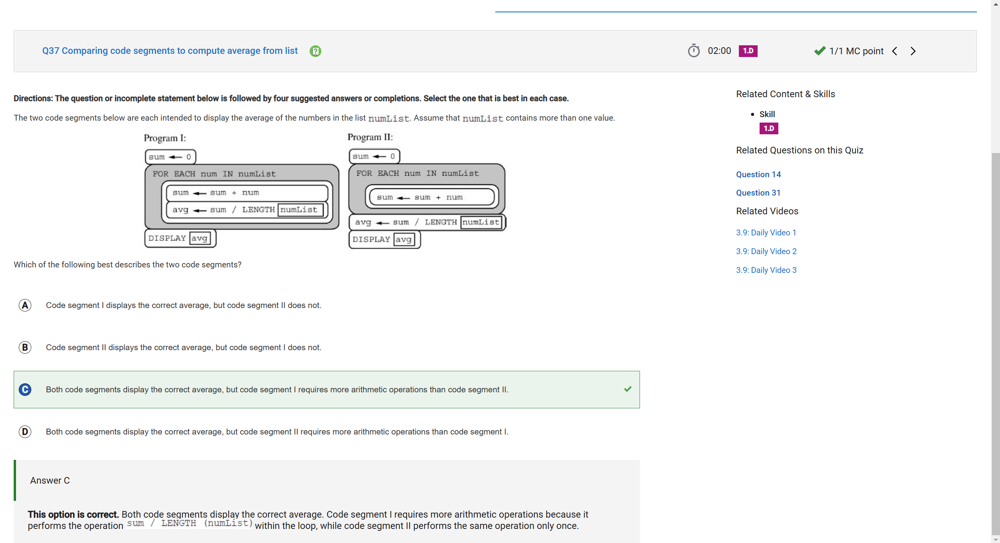
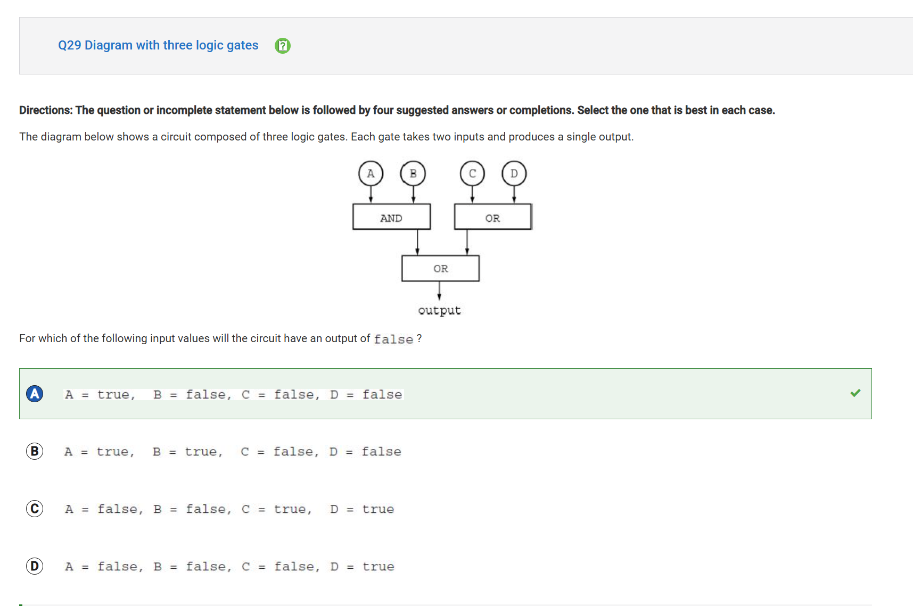
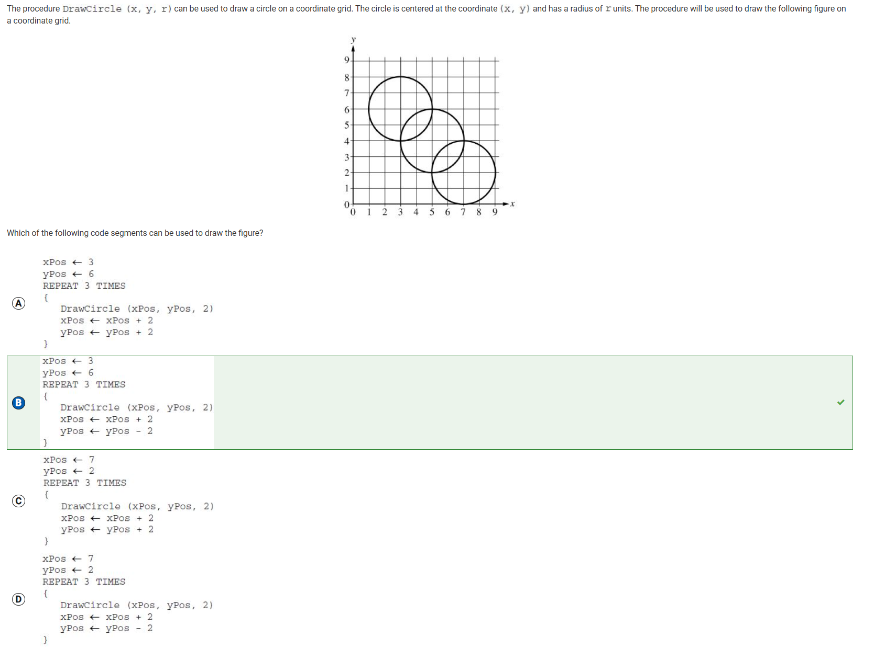
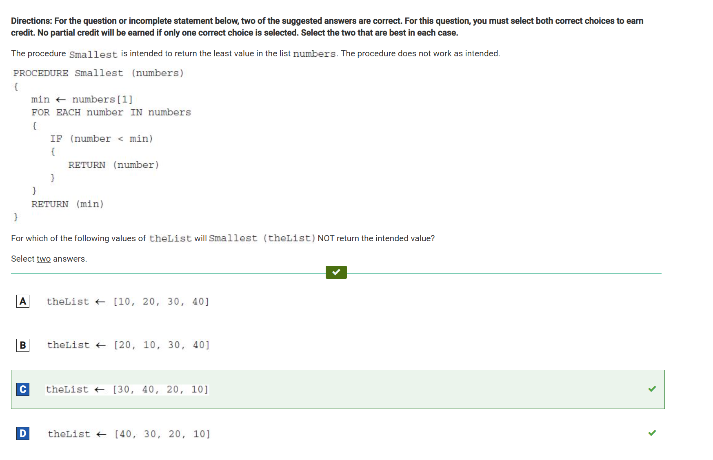
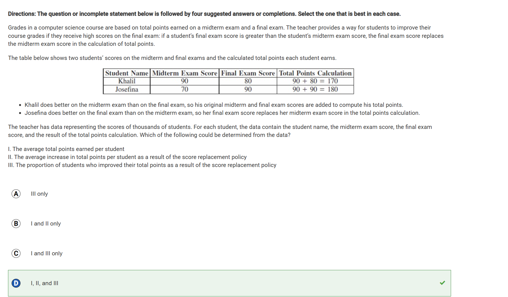

# MCQ Blog

I got 66/66 on this assignment so this blog will primarily be focused on questions I spent the longest time on and had the most difficulty with.

I will go over each Big Idea from 1-5 and go through the question I found most difficult for each of those Big Ideas.

Proof of Score:  

## Big Idea 1

I found this question to be the most challenging for this portion of the practice exam because of the actual applied logic required to answer this question. I had to manually go through each of the steps in both of the proposed code solutions and figure out which one worked in accordance to the answers, which caused an influx in time to solve this problem.

Answer choice C is correct for this question because it doesnt calculate the averga after every iteration, but rather does it at the end.  

## Big Idea 2

This question was the most time consuming because it is about logic gates. While I have some past experience with how logic gates work, I needed a little refresher to get the juices flowing again. I manually tried every option choice to check its output, and thus landed at option choice A.

This answer is correct because if we consider the following table,

| Variable | Value  |
|----------|--------|
| A        | True   |
| B        | False  |
| C        | False  |
| D        | False  |

A AND B gives False, C OR D gives False, and False OR False outputs False, which is what we were aiming for.

## Big Idea 3

I found this question to be the hardest because it was a culmination of math and computer science. I had to think about how I myself would try to draw it, and then try to replicate it in code for the computer, which I think is a very important skill to have while coding.

My answer is right because it starts at (3,6), and it draws a circle with raiud 2, and moves the circle right 2 and down 2, and repeats this thrice. Repeating this procedure by hand would result in the same graph being drawn.

## Big Idea 4

This was for me, the hardest question in Big Idea 4 because of its requirement to find the impurity with the given code. These types of problems are always hard for me, and thus took the most time for me on this section. The error I eventually I found was that, if the first number of the list is less than the second number, it automatically returns the first number, without checking the rest of the list to find any other possible minimums.

However, if the first number is not less than the second number, it will return the second number.

My answer is correct for this question because both testcases fail in this code. In Option C, 30 is less than 40, and so 30 gets outputed (instead of 10). Similarly, in Option D, 40 is not less than 30, so it will automatically output 30 (again instead of 10).

## Big Idea 5

In Big Idea 5, this was the most challenging question due its more math oriented nature, not computer science. Reading through the data table and identifying the nuances with how the final grades are calculated took some time for me, and was not as easy as some of the other questions. In the end, all 3 options are right because it is possible to calculate the average (add up all the total scores and divide by number of entries), the average increase (total points - (midterm + final)), and the proportion of students who improved their total points, again by doing the aforementioned calculation.